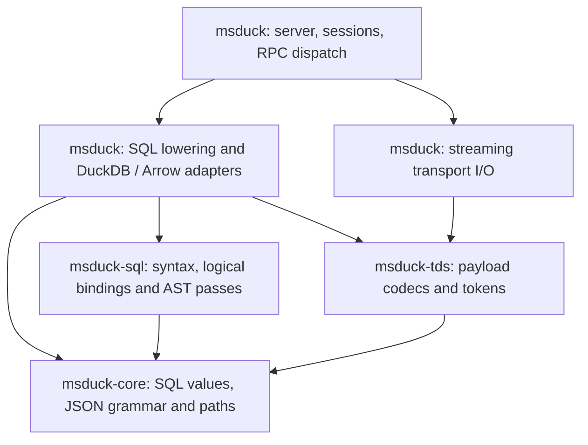

# Architecture and crate boundaries

The workspace separates deterministic rules from adapters that execute effects.
SQL syntax, AST passes and snapshot-based projection and operand binding have
their own crate. Catalog acquisition, remaining execution lowering and native
adapters live in the root and retain session and DuckDB dependencies.



| Crate | Owns | Must not own |
| --- | --- | --- |
| `msduck-core` | Exact DATETIME2/DATETIMEOFFSET values, calendar arithmetic, parsing/formatting, bounded value encodings, JSON lexical validation, path extraction and OPENJSON row/schema rules, character types/storage/CAST rules, Windows-1252 encoding, SQL runtime error identity | Database/Arrow types, SQL AST/session types, sockets, files, clocks, randomness, environment reads |
| `msduck-tds` | Bounded payload cursors, login/prelogin payload handling, metadata and diagnostic tokens, transaction request codecs | Connection lifecycle, stream reads/writes, session mutation, SQL execution, DuckDB/Arrow values |
| `msduck-sql` | Dialect/MERGE parsing, logical parameter/type adapters, OPENJSON path tokens, AST builders, APPLY/TOP/window/grouping transformations and validation | DuckDB/Arrow types, catalog I/O, session/runtime state, protocol encoding, clocks, randomness, environment reads |
| `msduck` | Catalog acquisition and remaining backend lowering, DuckDB/native vector adapters, engine/session state, RPC dispatch, stream framing I/O, listener lifecycle | New hidden effects inside the extracted deterministic crates |

All three extracted crates forbid unsafe code. The core depends on `anyhow`,
`serde_json` (for JSON string decoding), and `num-bigint` for exact decimal
division intermediates beyond i128; TDS depends on the core and `anyhow`.
SQL depends on the core, `anyhow` and the workspace's pinned `sqlparser` version.
Core imports neither SQL nor TDS, and none imports the root. Local mutation of an input
buffer or an internal parser stack is compatible with this boundary: results
must depend only on explicit inputs, with no external effects or ambient state.
Clock readings, generated IDs, configuration and database data should be acquired
by adapters and passed into rules as values when those rules need them.

Existing public paths (`msduck::datetime2`, `msduck::datetimeoffset`, and
`msduck::tds`, `msduck::parameter`, and `msduck::engine::Parameter`) remain
available through re-exports. DuckDB result encoding tests
and streaming I/O tests stay in the root, even when they exercise core values or
TDS tokens. Pure calendar, JSON and protocol-vector tests live with their rules.
No tests were removed by the extraction.

## SQL syntax and transformation boundary

The initial `msduck-sql` extraction moved about 2,300 lines from the root;
projection inference and shared expression metadata rules have since moved too. Its dialect
extensions, MERGE validation, named windows, window placement/frames, grouping
rules, APPLY/TOP lowering and function-argument checks transform explicit ASTs.
OPENJSON variable-path token handling is separate from its native execution
adapter. Temporal declaration recognition is separate from native temporal casts.
Shared AST constructors no longer require importing the engine.

The `Parameter` type and logical-type/parser adapters live here as well. The
root's existing module paths re-export them. Ten existing pure tests moved with
their implementations; the two parameter-declaration tests still exercise the
engine's complete batch path in the root. Native callbacks, catalog-backed
binding and client tests also remain root-side.

The extraction also exposed named-window validation that iterated a hash map.
It now resolves definitions in source order, so multiple invalid definitions
produce a stable first error. An additional regression test covers independent
missing references, cycles, unchanged ASTs on definition failure, and valid
forward references. This defines deterministic local diagnostic selection;
SQL Server's precedence between multiple invalid definitions is not yet compared.

The SQL crate now owns batch parsing and syntax normalization as well as
projection and operand inference over explicit catalog snapshots. The root
orchestrates these operations and pure batch preflight, acquires catalog records,
maps logical result shapes to wire metadata, lowers remaining backend operations
and executes statements. A complete typed execution plan remains future work.

## Character conversion boundary

`msduck_core::character::CharacterType` validates family and length at construction.
`Length::Max` is a domain value, not the backend's `-1` sentinel. `store` enforces
storage overflow and trailing-space rules; `cast` applies explicit source-category
rules and returns typed errors. The core has no knowledge of AST nodes, native
vector layout or database NULL flags. Unicode text casts borrow their input where
possible, rather than adding a per-row allocation.

Root adapters translate parser/native types into these values, read only valid
vector slots, propagate NULLs, and turn numeric overflow into NULL for TRY_CAST.
Encoding is shared by conversion rules and TDS through a one-way TDS-to-core
reference; existing public codec paths remain re-exports.

## JSON extraction boundary

`msduck_core::json_path` owns path parsing, source selection and scalar/fragment
extraction. It shares the core's lexical scanner and preserves source spelling
for numbers and containers. The low-level selector returns a source suffix;
callers must validate the selected value, or the whole document for a missing
path. This preserves early matches before unrelated malformed trailing text.

JSON_VALUE/JSON_QUERY and OPENJSON adapters import the same core rules. SQL AST
lowering, native vector reads, NULL propagation, result metadata and DuckDB error
wrapper removal stay in the root. Pure extraction tests live in the core;
chunked NULL and volatile-input tests still exercise the real DuckDB adapter.

`msduck_core::openjson` owns default rows, explicit-schema source rows,
scalar/fragment column selection and Base64 binary conversion. These operations
validate the whole input document and retain OPENJSON-specific diagnostic states.
The root owns SQL column declarations and casts, AS JSON declaration checks,
metadata, UNNEST lowering, and native list/struct vector allocation. No parser or
DuckDB types cross into these core operations. Existing pure row/schema/Base64
tests moved into the core; native chunk and single-evaluation tests stay root-side.

## Diagnostic boundary

`msduck_core::diagnostic::SqlError` carries a SQL error's number, state, severity and
message. Constructing it never classifies message text. JSON message classifiers
return this type, and TRY/CATCH and explicit THROW preserve the same identity.
The TDS codec accepts the value directly; it does not depend on engine types.

DuckDB wrapper removal and fallback backend-message classification remain in the
root. A typed error takes precedence over its message, including through an
`anyhow` context. Typed runtime errors default to severity 16, while typed compilation errors
carry severity 15 explicitly. Batch preflight and preparation RPC paths preserve
that identity through the shared root emitter. Line/procedure context and typed
errors from every execution path remain future work. Native scalar boundaries
still transmit error strings that the adapters recognize exactly.

## Parameter value boundary

RPC decoding and local variable bindings now use `msduck_core::value::Value`.
It retains scalar integer widths, floating-point widths, text/binary contents,
date epoch counts and explicit timestamp units without importing DuckDB. Its
validated decimal carries precision, scale and an exact signed coefficient.
Decimal structural equality includes the declaration; it is not SQL numeric
comparison. Construction checks precision 1..=38, scale 0..=precision and
coefficient range; it performs no rounding or coercion.

`parameter::Parameter` pairs this value with `msduck_core::types::Type`, a
logical SQL declaration. Decimal precision/scale, temporal scale and binary
lengths are validated core values; character types reuse the existing validated
core representation. MONEY, SMALLMONEY, DATETIME and SMALLDATETIME retain their
identity separately from decimal/timestamp storage. Scalar SQL byte widths live
with these types and drive DATALENGTH, including UNIQUEIDENTIFIER's 16 bytes.

`sql_type` resolves parser declarations and generates logical AST types for
existing compiler transforms. Declaration defaults are explicit: omitted
character/binary length is 1, DECIMAL is (18,0), and temporal scale is 7. CAST
length defaults remain in CAST lowering. The old `engine::Parameter` path remains
a re-export, but Rust callers now supply core values and types. RPC decoding
constructs logical types directly, without parser types; zero-width empty wire
values use a minimum logical capacity of one while retaining original payload
bounds. Prepared-handle accounting includes the fixed-size type representation.

`backend_value` converts values at execution boundaries; unsupported backend
containers are rejected rather than stringified. The engine still normalizes
TIME to exact text before rebinding, avoiding the backend's microsecond binder
truncation. GUID, DATETIME2 and DATETIMEOFFSET retain their existing text value
representations with a separate logical declaration. SQL_VARIANT variables remain
unsupported; representing a type does not imply full execution support.

The logical type contract is now in use, but compiler extraction is incomplete.
Catalog type records use named backend-independent fields. Pure expression/result
inference receives explicit snapshots; the root acquires those snapshots and
retains catalog-backed wire metadata fallback and session compilation. A unified
compilation input and typed plan remain necessary for a standalone compiler.

## FOR JSON serialization boundary

`msduck_core::for_json` compiles ordered PATH aliases and renders typed rows.
Text, SQL NULL, booleans, lexical numbers and promoted JSON are distinct inputs.
The flat plan and iterative writer have no SQL AST, database or transport types.
The SQL crate validates FOR JSON syntax and aliases; the root binds and executes
outer PATH queries and marshals their values through this writer. Nested and
correlated PATH queries use a SQL-crate AST wrapper with root-owned native row
marshalling and DuckDB aggregation. Wrapper lowering runs after source annotation,
so generated native expressions do not acquire SQL conversion casts. Base64 and
aggregate JSON framing remain pure core operations. AUTO and complete expression
provenance remain open; see [FOR JSON adapter work](for-json.md).

## Development loop

```sh
# No DuckDB build or link for this test loop:
cargo test -p msduck-core -p msduck-tds
cargo clippy -p msduck-core -p msduck-tds --all-targets -- -D warnings
cargo tree -p msduck-core -p msduck-tds

# SQL syntax and standalone AST passes, also without DuckDB/Arrow:
cargo test -p msduck-sql
cargo clippy -p msduck-sql --all-targets -- -D warnings
cargo tree -p msduck-sql

# Full verification:
cargo fmt --all --check
cargo test --workspace
cargo clippy --workspace --all-targets -- -D warnings
npm test
npm run audit:local
```

Workspace default members include all four crates, so plain `cargo test` also
retains complete Rust coverage. npm scripts build all workspace targets before
running the unchanged independent client and audit harnesses.

## Build observations

On the development machine during the initial crate extraction, before moving
character conversion rules:

- Before extraction, rebuilding the changed monolithic crate and running
  `cargo test --lib datetime2::tests` took 9.489 seconds (five tests, including one
  DuckDB encoding integration test).
- After extraction, building **both** deterministic crates in an empty target
  directory and running their 16 tests took 3.358 seconds. Only `anyhow` was built
  as an external dependency; no DuckDB/Arrow/native C++ build or link was involved.
- Touching the extracted `datetime2.rs` and rerunning
  `cargo test -p msduck-core datetime2::tests` took 1.700 seconds (four pure tests).
  The removed fifth test still runs in the root as a DuckDB/TDS integration test.

These are local observations, not a controlled speedup ratio: the test sets and
cache states differ. Full-server rebuilds still compile the large root crate and
link DuckDB. Changing a core public API can rebuild its dependents. The immediate
benefit is a small isolated edit/test loop and explicit dependency direction,
not a claim that all builds became faster.

After the initial extraction, before the diagnostic-order regression test, an
offline build on 2026-09-22 in a new empty
target directory compiled the SQL crate and ran its ten tests in 34.548 seconds.
Crate sources were already cached, and client/audit checks ran concurrently.
The build included sqlparser and its dependencies but no DuckDB, Arrow or root
server crate. This verifies an independent clean build, not a comparative
speedup. The test bodies themselves took 0.01 seconds in that run.

With dependencies cached, changing the named-window validation and running
`cargo test -p msduck-sql` rebuilt the SQL crate in 1.32 seconds as reported by
Cargo; all eleven test bodies completed in 0.01 seconds. This is the isolated
edit/test loop. It does not measure a full server rebuild or native link.

To repeat the isolated clean measurement without rebuilding DuckDB, choose an
empty directory and run:

```sh
CARGO_TARGET_DIR=artifacts/core-build-measure-new \
  cargo test -p msduck-core -p msduck-tds

# Use a different empty directory to measure the SQL syntax crate:
CARGO_TARGET_DIR=artifacts/sql-build-measure-new \
  cargo test -p msduck-sql
```

## Next boundaries

1. Extract more pure numeric and temporal rules from native
   vector callbacks. Keep argument/result marshalling and unsafe vector reads in
   adapters; avoid moving DuckDB dependencies into the core for convenience.
2. Extend the shared logical SQL type model to catalog records and result
   inference, and extend runtime error identity to remaining diagnostics.
   Parameter values and declarations are now backend-independent; catalog/result
   coupling remains before moving more binding passes into `msduck-sql`.
3. Separate parsing/binding/planning from execution using explicit inputs and
   a typed plan. Catalog reads belong behind an adapter or a supplied snapshot,
   not inside pure transformations.
4. Separate the DuckDB adapter from the runtime once those value and plan contracts
   exist. Keep transaction ownership, cancellation, clocks and connections in the
   imperative shell.

Crates follow stable dependency boundaries, not individual SQL functions. Avoid
one crate per file, dependency cycles, generic dependency-injection machinery
without a concrete boundary, or duplicating types to bypass the extraction work.

The next extraction should strengthen the compiler contract within these four
crates before introducing another package. Planning should consume an owned AST,
logical parameter declarations, explicit session options and a catalog snapshot,
and return a typed plan or diagnostics. Acquiring the snapshot and executing the
plan remain shell operations. Runtime-dependent values such as current time and
generated IDs must retain their SQL evaluation timing; planning must not eagerly
sample them just to make its inputs explicit.

Measure isolated crate edit/test loops and full server rebuilds separately when
evaluating further splits. A new crate can avoid an unrelated compile or native
link during targeted tests, but changes to shared interfaces still invalidate
dependents. The existing root engine's size alone is not a sufficient reason to
create a crate that would merely carry the same mixed responsibilities.


## Inherited CTE catalog snapshots

The root catalog adapter now supplies explicit CTE snapshots to nested FOR JSON
binding. Query traversal keeps the inherited scope, each WITH definition's scope
and the completed body scope separately. Declarations retain aliases and logical
metadata; unresolved declarations shadow base objects and unknown star sources
remain unknown rather than contributing an empty column list. Snapshots are
caller-owned values; they contain no live database handle or shared mutable state.
Their fields now contain backend-independent `TypeMetadata` values. Catalog
acquisition stays in the adapter. Projection inference and CTE snapshot
construction now consume the captured catalog without further database access. Queries without nested FOR JSON bypass this additional binding.


The same catalog snapshots now include enclosing FROM-source metadata for nested
JSON projections. Resolution walks from local to outer scopes and records
shadowing even when a local type is unknown. Unknown-source scopes are barriers;
CTE definitions start without inherited row bindings. This avoids treating
missing type information as permission to reuse an outer declaration. Source
collection and catalog reads remain in the root adapter; serializers still receive
explicit typed values and know nothing about lexical scopes or database handles.

## Catalog metadata and name lookup boundary

`msduck_core::catalog::TypeMetadata` replaces positional DuckDB values with named
fields for system/user type identity, byte length, precision, scale and collation.
Optional fields preserve unknown catalog properties; MAX retains its catalog -1
length marker. This record describes catalog declarations, separately from the
validated logical value types. It does not imply support for every represented type.

`msduck_sql::catalog_shape` computes declaration overrides, including the existing
distinction between omitted DDL and CAST lengths. `msduck_sql::binding_scope` owns
row-source fields and nearest-scope lookup. It takes explicit local and outer
sources, and preserves local unknown/ambiguous names and unresolved-scope barriers.
Neither module imports DuckDB. The declaration-width test moved into the SQL crate;
additional pure tests cover CAST defaults and scope barriers.

Root `declared_columns` reads typed catalog rows and encodes values for persistence.
A database integration test round-trips all seeded type records, including alias
identity, MAX, collation and an all-unknown record. Existing restart, rollback, CTE
and correlated JSON tests remain at the adapter boundary. Root result inference
and JSON serialization consume named metadata fields directly. Catalog fetching,
CTE snapshot construction and projection expression inference now live in the SQL
crate and use explicit catalog inputs. This is not a complete standalone binder
or typed execution plan.

Verification for this extraction (2026-09-22): 249 workspace Rust tests and 297
client tests passed; formatting and strict workspace Clippy passed. All 193 local
compatibility audit cases completed, with execution captures identical to the
pre-extraction snapshot. The SQL dependency tree contains neither DuckDB nor Arrow.
These checks establish local regression evidence, not full SQL Server compatibility
or a measured full-server build speedup.

## Catalog acquisition and projection inference

`msduck_sql::catalog_snapshot::CatalogSnapshot` carries the current type catalog
and ordered columns for referenced table names. The root adapter collects table
names in deterministic order, binds catalog lookup values, and captures each name
once per inference request. No query expressions are executed to acquire metadata.
CTE declarations still shadow captured base-table entries during inference.

`msduck_sql::projection` takes this snapshot and lexical scope explicitly;
recursive query/source/expression inference no longer accepts a connection or
returns database errors. CAST metadata overrides apply to captured type records.
The adapter retains acquisition errors and persistence. Snapshots are local to a
request, with no process-global cache or cross-DDL reuse. The lexical `Scope` and
`QueryScopes` records also live in the SQL crate.

A regression captures a table before and after ALTER COLUMN, then drops the table
and closes its database. Inference from the earlier snapshots still yields the
corresponding TIME scale and NVARCHAR widths; the post-drop snapshot stays unknown.
This demonstrates separation from a live connection, not an atomic catalog snapshot
guarantee under concurrent DDL. Shared pure expression helpers have now moved into
`msduck_sql::expression_metadata`. Other compiler passes retain their own catalog
access, and no full typed execution plan exists yet.

Verification for explicit snapshot acquisition (2026-09-22): 251 workspace Rust
tests and 297 client tests passed, along with formatting and strict Clippy. All
193 local audit cases completed with unchanged execution captures. The client
run took 497.2 seconds (the preceding extraction run took 459.2 seconds); these
were not controlled performance measurements, and this change makes no runtime
or build-speed improvement claim. Snapshot acquisition currently repeats across
separate inference requests; sharing a request-scoped snapshot is future work.

## Standalone projection inference

`msduck_sql::projection` binds known projection names and declarations from supplied
catalog and lexical snapshots. CTEs, derived sources, OPENJSON columns, correlated
name lookup and the existing limited TIME set inference run without DuckDB. Unknown
source metadata and ambiguous or shadowed columns retain their existing barriers.
This remains conservative metadata inference rather than a complete SQL binder.

`expression_metadata` groups shared conditional-argument validation, temporal scale
inference, storage declarations and OPENJSON declaration defaults. Root lowering
uses re-exports of these same implementations; it does not keep a second copy.
Native vector callbacks, database acquisition, actual conversions and temporal
constructor execution remain in adapters. Existing database/client tests remain
root-side, including the volatile-expression checks.

Two new isolated SQL tests combine catalog snapshots with CTE chains, derived
VALUES, OPENJSON declarations, ISNULL/COALESCE/character expressions and correlated
shadowing. The SQL-only run built core and SQL in 3.46 seconds with cached
dependencies and passed 18 tests; neither DuckDB nor Arrow was built or linked.
This demonstrates the isolated edit/test loop, not a controlled speedup ratio.

Verification for standalone projection inference (2026-09-22): 253 workspace Rust
tests and 297 client tests passed; formatting and strict workspace Clippy passed.
All 193 audit cases completed with identical execution captures to the prior
snapshot. The SQL crate dependency tree contains neither DuckDB nor Arrow. Full
SQL Server compatibility and the complete compiler/executor split remain unproven.

Projection `Field` now includes JSON-fragment provenance independently of catalog
`TypeMetadata`. Pure inference forwards this flag only from recognized fragment
expressions or resolved source fields; serializers consume it as an explicit
input. Catalog acquisition marks persisted columns as ordinary values, and catalog
writes do not persist the flag. This keeps expression provenance separate from
SQL storage types and avoids treating arbitrary NVARCHAR contents as JSON.

Qualified-star source lookup and expansion now also live in `msduck-sql`. The
projection binder resolves a source against explicit local/outer snapshots; a
separate AST pass emits qualified, quoted column references for DuckDB execution.
No source expression is copied or evaluated. Root JSON lowering invokes the pass
only when a qualified star exists, then uses the same typed-field metadata for
serialization. Unknown or ambiguous sources remain explicit failures.

CTE declaration snapshots now come from one SQL-crate routine shared by standalone
projection inference and query visitors. Both reserve all names before resolving
definitions, mask self references and clear enclosing row scopes for definitions.
This fixes standalone inference borrowing same-named base-table or outer-CTE
metadata while visitor inference correctly treated the declaration as unknown.
Explicitly schema-qualified base references still bind to the supplied catalog.
Unknown CTE projections remain unknown; this metadata policy does not implement
recursive CTE types or complete language validation/diagnostics.

Verification for shared CTE declaration binding (2026-09-22): the new pure test
failed against the former standalone binder, then passed after unification.
All 257 workspace Rust tests and 299 client/harness tests passed, together with
formatting and strict Clippy. All 195 local audit cases completed with unchanged
execution captures. Runtime CTE validation and recursive execution remain outside
this metadata fix.

CTE column-list cardinality validation is now a pure SQL-crate pass over an AST
and an explicit catalog snapshot. Syntax-known mismatches fail batch preflight;
star projections that require catalog metadata are checked during preparation
and statement execution. Validation does not evaluate projection expressions.
The root adapter acquires current metadata only for statements with explicit CTE
column lists. Errors 8158/8159 use severity 15. Unknown projection widths remain
deferred; recursive CTE execution, duplicate aliases and complete name diagnostics
are not implemented by this pass. Catalog-dependent errors do not guarantee that
prior statements in the same batch have had no effects.

Verification for CTE cardinality validation (2026-09-22): the client regression
failed before the change and passes afterward. All 258 workspace Rust tests and
300 client/harness tests passed, alongside formatting and strict Clippy. All 197
local audit cases completed; the previous 195 execution captures are unchanged,
and the two new probes record 8158/8159 at severity 15 with successful reuse.
The SQL-only edit/test run took 2.34 seconds with cached dependencies and required
no DuckDB linking. No live SQL Server comparison was performed.

CTE name validation now shares the same pure pass as cardinality validation.
Explicit column lists override definition labels; otherwise expressions must
supply names and the resulting names must be unique. Set expressions take names
from their left branch. Stars use the existing snapshot binder, so duplicate
names and unnamed-column ordinals account for their expanded widths. JSON/XML
serialization supplies an unnamed scalar for this check. SQL name validation
never adopts backend-generated expression labels. The adapter now collects a
snapshot for any statement containing a CTE, including declarations without an
explicit list. Name comparison follows the existing case-insensitive binder;
complete collation-sensitive identifier comparison remains unfinished.

Verification for CTE output names (2026-09-22): the new client regression failed
against the preceding server and passes after validation. All 259 workspace Rust
tests and 301 client/harness tests passed; formatting and strict Clippy passed.
All 199 audit cases completed. Of 197 preceding execution captures, 196 are exact
matches; `derived table apply`, which has no ORDER BY, returned its same two rows
in reversed order. The raw difference was retained. New probes record 8155/8156
at severity 15 and successful connection reuse. No live SQL Server comparison
was performed.

Duplicate CTE declaration validation now runs before construction of declaration
snapshots, so repeated names cannot replace an earlier entry in the scope map.
It is scoped to each WITH list, preserves the input AST and reports error 239.
The existing preflight/preparation/execution adapters all use this same pure
check. Separate statements may reuse CTE names, and a CTE may still shadow a
same-named base table. Identifier collation behavior remains limited to the
existing case-insensitive binder policy.

Verification for duplicate declarations (2026-09-22): the regression first
observed a DuckDB parser error, then passed with SQL Server error 239. All 260
workspace Rust tests and 302 client/harness tests passed, as did formatting and
strict Clippy. All 200 local audit cases completed. Of 199 earlier execution
captures, 198 are identical; the unordered `derived table apply` case returned
the same rows in reverse order. The raw difference was retained. The new probe
records 239 at severity 16 and successful connection reuse. SQL Server comparison
and full CTE execution binding remain unverified/unfinished respectively.

Recursive CTE structure is now analyzed by `msduck-sql::cte_recursion`, invoked
before catalog projection snapshots are built. It counts unqualified self table
references with nested WITH-name masking, partitions a top-level UNION ALL tree
into members and validates the anchor/recursive boundary. The pass neither reads
a catalog nor mutates the AST. It rejects malformed self references even when a
same-named base object exists. Schema-qualified references remain base objects.
Execution lowering, recursion limits, recursive metadata and remaining recursive
member restrictions still require implementation.

A manual backend-lowering probe used explicit WITH RECURSIVE with a depth column:
anchor depth 0, recursive depth `CASE WHEN depth>=100 THEN error(...) ELSE
depth+1 END`, and an outer `depth<=100` filter to keep the depth dependency live.
Both row projection and COUNT(*) returned 101 rows for 100 recursive steps and
raised an error for the next step. This is experimental evidence for a future
lowering pass, not an implemented T-SQL recursion feature. Hidden-column hygiene,
star expansion, exact type matching, MAXRECURSION parsing, DML rollback and broader
optimizer cases still need verification before that pass is enabled.

Additional depth-guard probes kept the error through an outer `n<10` filter on
COUNT(*), and an INSERT from an exhausted recursive source left its destination
empty. These cover the current backend's aggregate and statement-atomicity paths;
they are manual experiments, not yet committed execution support or a live SQL
Server comparison.

Verification for recursive structure (2026-09-22): the new client regression first
observed silent base-table fallback, then passed after validation. All 261 Rust
workspace tests and 303 client/harness tests passed, with formatting and strict
Clippy. All 204 local audit cases completed; the preceding 200 execution captures
are identical. Four new probes record 246/247/252/253 at severity 16 and successful
connection reuse. No live SQL Server comparison was performed.

`msduck-sql::recursive_lower` now implements the depth-guard design. The root
adapter acquires a catalog snapshot only for ASTs containing self-referencing
CTEs. The pure pass stages changes on a clone, partitions anchors and recursive
members, expands known stars before adding a private depth column, and wraps the
native recursive CTE to expose only user columns. Generated names avoid all
identifiers in the definition. Lowering visits original children before parents,
so generated recursive queries are not recursively lowered again. A failure
leaves the caller's AST unchanged. Projection expressions remain single copies.

Preparation, statement execution and scalar-expression paths invoke the same
pass before result inference and backend translation. The native recursive query
shadows same-named base objects. Its guard permits 100 recursive steps and raises
530 on the next; the outer depth predicate keeps that dependency live under
aggregate optimization. Known anchor/member type descriptors are compared,
including widths, precision and scale; unknown expression types still need full
inference. The pass currently uses the default limit only. Explicit MAXRECURSION,
complete recursive-member restrictions and rich recursive metadata remain open.

Verification for bounded recursive execution (2026-09-22): the client regression
failed against the previous binder and passes after lowering. All 262 workspace
Rust tests and 304 client/harness tests passed, along with formatting and strict
Clippy. All 207 local audit cases completed, with all 204 preceding execution
captures unchanged. New probes verify ordered finite rows, 530 exhaustion and a
known 240 type mismatch. Error 530 currently retains DuckDB's `Invalid Input
Error:` message prefix. No live SQL Server comparison was performed.

`msduck-sql::query_options` now parses MAXRECURSION as a validated unsigned
literal from 0 through 32767. It uses a namespaced, unquoted internal key in the
AST settings slot, following existing dialect-marker conventions. The key cannot
be produced by the T-SQL identifier tokenizer and is removed before backend SQL
is emitted. INSERT normalization carries the hint onto its source query rather
than rejecting or dropping it. Other query-hint combinations remain unsupported.

Recursive lowering keeps an explicit stack of statement/query limits. Descendant
queries inherit their statement's limit; later statements start with 100 again.
Positive values guard recursive steps, while zero emits neither an exhaustion
guard nor a growing depth counter. Error 530 is decoded into a typed diagnostic
with the configured value and without a backend prefix. Parse-time values above
32767 report 310 at severity 15, including before preceding batch writes. SELECT
and CTE-prefixed INSERT, UPDATE and DELETE paths are covered; this does not yet
establish hint behavior through persisted recursive views or every statement form.

Verification for MAXRECURSION (2026-09-22): the new client regression first failed
at parsing, then exposed and verified the INSERT hint-transfer fix. All 264 Rust
workspace tests and 305 client/harness tests passed, with formatting and strict
Clippy. All 210 local audit cases completed. Of 207 preceding captures, 206 are
identical; the sole intended difference removes DuckDB's prefix from the default
530 message. New probes verify 150 rows with MAXRECURSION 0, custom exhaustion at
2 and excessive-value error 310 at severity 15. The 310 message still carries the
legacy parser prefix. No live SQL Server comparison was performed.

Recursive-member restrictions now belong to the pure structural validator rather
than a generic backend-lowering rejection. After identifying the recursive
members, it checks DISTINCT (460), TOP/OFFSET (461), outer joins (462), recursive
references inside subqueries (465), and GROUP BY/HAVING/known scalar aggregates
(467). These checks participate in batch preflight, preparation and execution.
Anchor members are not subject to those checks, and windowed aggregates retain
their per-generation behavior. Nested query scopes are tracked separately, so
checks do not blindly classify every function under the member as an aggregate
of its outer rows. The redundant generic lowering rejection was removed.

This covers the named restrictions above, not the complete recursive-member
language surface. PIVOT and function/side-effect restrictions, complete type and
metadata inference, and precedence between simultaneous errors remain open.

Verification for recursive-member restrictions (2026-09-22): the regression first
observed a generic unsupported error and now verifies the SQL Server identities.
All 265 workspace Rust tests and 306 client/harness tests passed, together with
formatting and strict Clippy. All 215 local audit cases completed; the previous
210 execution captures are unchanged. Five new probes verify 460/461/462/465/467
at severity 16 with connection reuse. No live SQL Server comparison was performed.


Recursive table-source restrictions are now checked in the same deterministic
validator. PIVOT in a recursive member produces 4190, and hints attached to an
unqualified recursive reference produce 4150. A shared self-reference predicate
keeps reference counting and hint checks aligned, including case-insensitive
names, aliases, schema-qualified base tables and table-function distinctions.
The checks run before backend rewriting, so native DuckDB parser messages do not
leak for these cases. Pure tests preserve anchor PIVOT and base-table hints; this
does not claim backend execution support for those independent features.


Verification for recursive table-source restrictions (2026-09-22): formatting,
strict Clippy, all 266 workspace Rust tests and all 307 client/harness tests
passed. All 217 local audit cases completed. The previous 215 execution captures
are unchanged; new probes report 4150 and 4190 at severity 16, state 1, with
successful connection reuse. No live SQL Server comparison was performed.


Recursive output binding now starts from the complete anchor prefix selected by
`msduck-sql::cte_recursion::anchor`. Both pure projection inference and the root
expression binder use this same structural split. The pure layer installs the
renamed anchor fields in the definition scope before visiting recursive members,
and retains them through generated WITH RECURSIVE wrappers and later CTE/derived
projections. Unknown anchors keep the existing shadowing barrier; recursive
fields do not inherit JSON-fragment promotion from anchors alone.

The root binder passes known arithmetic operand column types to scalar lowering,
so a recursive VARCHAR/NVARCHAR self column can participate in T-SQL `+`
concatenation. This also enables the existing numeric conversion and integer
division rules for bound base-table operands. Annotation copies column references,
not the expressions that produce their values. No database dependency was added
to the SQL crate. General common-type inference across multiple anchors and full
arithmetic result inference for recursive type validation remain unfinished.


Verification for recursive anchor propagation (2026-09-22): formatting, strict
Clippy, all 267 workspace Rust tests and all 308 client/harness tests passed.
All 219 local audit cases completed; the previous 217 execution captures are
unchanged. New captures show VARCHAR(5) rows a/ab/abb and an empty nullable
NVARCHAR(8) result with its 16-byte declared width. The original client regression
failed with the native character-addition binder error before this change.
No live SQL Server comparison was performed.


Character set-result binding now uses one pure rule in
`msduck-sql::expression_metadata::character`. Both catalog-backed projection
inference and root operand binding combine CHAR/VARCHAR or NCHAR/NVARCHAR
widths, keep the fixed family only when both operands are fixed, and preserve
MAX. Unicode lengths are converted from catalog bytes to declared byte-pairs.
Catalog inference retains a shared input collation rather than replacing it
with the database default; conflicting collations, alias identities and mixed
encodings remain unknown because their full precedence rules are not modeled.

This fixes recursive definitions with multiple known character anchors, including
unequal widths, subsequent concatenation and known recursive-width mismatch
checks. The scalar classifier also uses the existing retained-character-argument
rule for TRIM/LTRIM/RTRIM/UPPER/LOWER, so trimming a bound character column does not
lose its character category before `+` lowering. General numeric anchor merging,
cross-encoding/collation precedence, and recursive arithmetic-result checking
remain unfinished.


The shared set rule also improves persisted view metadata: a view over
NVARCHAR(5) UNION ALL NVARCHAR(7) now records NVARCHAR(7), max_length 14, instead
of unknown catalog fields. The old regression expected that known limitation;
its assertion now requires the precise type and byte length.


Verification for character anchor set binding (2026-09-22): formatting, strict
Clippy and all 269 workspace Rust tests passed. The first full client run passed
308 tests and exposed the obsolete unknown-view-metadata expectation described
above. After requiring NVARCHAR(7)/14 explicitly, the full rerun passed all 309
client/harness tests. All 221 local audit cases completed, and the previous 219
execution captures are unchanged. The two new captures show the expected four
recursive string rows with VARCHAR(5) metadata and error 240 for a VARCHAR(4)
recursive member; both connections remain reusable. No live SQL Server comparison
was performed.


Recursive arithmetic validation now derives known numeric expression types in the
pure SQL layer. `expression_metadata::arithmetic` uses explicit catalog metadata
for numeric precedence and decimal precision/scale formulas, including the
precision-38 reduction rules. Recursive member inference resolves local and outer
column references before applying the rule, handles nested binary expressions,
and preserves explicit casts as the result declaration. It does not evaluate
values, consult DuckDB, or duplicate producing expressions. Unknown operand types
and alias identities remain unknown.

This detects SMALLINT + INT and widened DECIMAL/NUMERIC recursive expressions as
240 instead of allowing DuckDB to coerce them back to the anchor type. Matching
smallint operands, explicit decimal result casts and shape-preserving modulo
remain valid. The rule checks known recursive member types; complete ordinary
expression metadata/coercion, parameter-dependent inference, unary expressions,
conditional/function result typing and all recursive cases remain open.


Verification for recursive numeric arithmetic typing (2026-09-22): formatting,
strict Clippy, all 270 workspace Rust tests and all 310 client/harness tests
passed. All 224 local audit cases completed. Of the previous 221 captures, 220
are unchanged; `derived table apply`, which has no ORDER BY, returned the same
two rows in reverse order. The four raw cell differences are retained in
`/tmp/msduck-recursive-arithmetic-comparison.json`. New probes verify integer and
decimal arithmetic mismatch error 240, successful explicit-cast recursion with
DECIMAL(5,2) metadata, and connection reuse. No live SQL Server comparison was
performed.


Numeric set-result inference now shares built-in precedence and decimal capacity
rules between pure projection inference and root operand binding. Unlike addition,
the set formula adds no carry digit: it combines the larger integral and fractional
capacities, reducing scale when precision would exceed 38. Known multiple numeric
anchors therefore retain a common type for recursive validation, DATALENGTH and
persisted view catalog metadata. Alias and unknown operand types remain unresolved.

`msduck-sql::set_coercion` builds positional casts before set comparison when
numeric operand types differ from their common type. Generated names avoid
identifiers already present in the member, and each projected expression remains
inside its original subquery and is evaluated once. The transformation is pure;
no DuckDB or wire dependency was introduced. The native currency range checker
lives in the root: exact DECIMAL(19,4)/DECIMAL(10,4) signatures expose scaled
integers, checked against i64/i32 bounds before copying to the output vector.
This enforces 8115 when another numeric type is converted to MONEY/SMALLMONEY in
a set. General standalone currency CAST/CONVERT, assignment and arithmetic range
semantics still need separate coverage and integration.

Verification for numeric anchor set binding (2026-09-22): formatting, strict
Clippy, all 272 workspace Rust tests and all 311 client/harness tests passed.
All 227 local audit cases completed. Of the previous 224 execution captures,
223 are unchanged; `derived table apply`, which has no ORDER BY, returned its
two rows in reverse order. The raw differences are retained in
`/tmp/msduck-numeric-sets-comparison.json`. The three new probes capture error
240 for incompatible recursive types, DECIMAL(38,2) set precision reduction,
and error 8115 for money set conversion overflow, with connection reuse.
Precision reduction already worked before the positional wrapper; the money
overflow was a demonstrated gap. No live SQL Server comparison was performed.

The currency checker now delegates range policy to
`msduck_core::money::MoneyType::check_scaled`. Its explicit input is an i128 in
units of 0.0001, already rounded by the caller. It returns typed SQL error 8115
on overflow and has no DuckDB, AST, session or wire dependency. Exact endpoint
and adjacent-unit tests run in the core, including negative endpoints and i128
extremes. The root still owns conversion to scale four, NULL propagation, native
vector reads/writes and backend error transport. This extraction does not extend
which SQL expressions receive currency range validation.

Verification for the currency-core extraction (2026-09-22): formatting, strict
Clippy, all 273 workspace Rust tests and all 311 client/harness tests passed.
All 227 local audit cases completed, and all 227 execution captures are unchanged
from the pre-extraction baseline, including currency overflow diagnostics.
The raw comparison is `/tmp/msduck-money-core-comparison.json`. No live SQL Server
comparison was performed; standalone currency conversions and storage remain
known gaps as recorded in ROADMAP.md.

Currency conversion now uses a shared pure AST plan in `msduck-sql::money_cast`.
CAST and style-free CONVERT round to DECIMAL(38,4), then invoke the root range
adapter, which delegates bounds to the core. The wider intermediate prevents
ordinary out-of-range currency values from failing a narrow decimal cast before
the currency check. TRY uses a TRY_CAST intermediate and a NULL-producing range
adapter; errors evaluating the source expression still propagate. Neither plan
duplicates the producer expression. Set-member casts now use this shared path.

INSERT and UPDATE restore MONEY/SMALLMONEY target declarations from catalog
metadata before assignment lowering. CREATE/ADD column defaults and ALTER COLUMN
conversion also use the shared plan. Native input is now DECIMAL(38,4)/HUGEINT;
output remains DECIMAL(19,4)/HUGEINT or DECIMAL(10,4)/i64 after bounds validation.
Focused coverage includes both signed endpoints, rounding across endpoints,
prepared TRY conversion, NULLs, multi-chunk conversion, atomic failed writes,
deferred defaults, variable initialization and failed ALTER backfill/conversion.
A root integration test verifies one sequence advance per row across 6,000 rows.

This is not complete currency compatibility: character-source error selection
(235/236), currency symbols and lexical formats, conversions exceeding the
DECIMAL(38,4) intermediate, styles, all source-type restrictions and arithmetic
result ranges still need work and SQL Server comparison.

The first currency audit exposed untyped NULL metadata for failed TRY_CONVERT.
The conversion plan now keeps an explicit result cast outside the native callback
so DuckDB NULL folding retains DECIMAL(19,4)/DECIMAL(10,4). Tests cover failed TRY
results and empty CTE projections. These remain the server's existing decimal
wire representation for currency; MONEY-specific TDS output fidelity is still
unfinished. CONVERT currency expressions also retain their source category when
subsequently converted to integers, preserving rounding instead of truncation.

Verification for currency conversion integration (2026-09-22): formatting,
strict Clippy, all 274 workspace Rust tests and all 312 client/harness tests
passed. The first full client run was stopped to fix the NULL descriptor issue
found by the audit; the final run completed without failures or cancellations.
All 230 audit cases completed. The previous 227 execution captures are unchanged;
three new cases cover numeric overflow 8115, TRY/rounding/endpoint values with
typed NULL metadata, and atomic failed assignment. All new connections remain
reusable. Raw comparison: `/tmp/msduck-money-conversion-comparison-final.json`.
No live SQL Server comparison was performed.

## Currency wire boundary

`msduck-tds` now owns MONEYNTYPE metadata and exact currency row encoding.
The codec accepts an explicit scale-four integer coefficient, validates currency
bounds through the core, and writes a nullable four- or eight-byte payload.
MONEY writes its high 32-bit word before the low word; each word is little-endian.
No floating-point conversion, SQL AST or native database type enters this codec.
Raw vectors cover word ordering, signs, endpoint coefficients, NULLs, metadata
and rejection without partial output.

The root retains declared currency widths from casts, style-free conversions,
parameters, catalog fields and supported conditional/set projections. It selects
MoneyN only over compatible scale-four decimal storage and passes the exact
DuckDB coefficient to the pure codec. Nullable MONEY/SMALLMONEY results therefore
use eight/four-byte MoneyN metadata rather than DecimalN. Mixed decimal/currency
sets still select decimal metadata. Broader expression provenance and precise
non-nullable/fixed-type metadata remain unfinished.

Independent tedious and Tiberius tests cover both widths, signed values, NULLs
and empty results. The tedious prepared fixture uses an exactly representable
SMALLMONEY input: its installed parameter encoder truncates `21.4748 * 10000`
to 214747 before transmission. The observed outgoing bytes are recorded in
`/tmp/msduck-money-wire-driver.log`; SQL-literal and exact-byte tests retain
four-decimal precision coverage. This client behavior was not normalized away
or changed in the server.

Verification for currency wire output (2026-09-22): formatting, strict Clippy,
all 276 workspace Rust tests and all 313 client/harness tests passed. All 232
local audit cases completed. Of the previous 230 execution captures, 229 are
unchanged; the remaining capture has eight intentional metadata-field changes
for two currency columns (DecimalN to MoneyN, lengths four/eight, and no decimal
precision/scale fields). Values, diagnostics and completion tokens are unchanged.
The two new captures verify declared/empty currency results, variables, mixed
currency widths and decimal-precedence sets, with connection reuse. Raw diff:
`/tmp/msduck-money-wire-comparison.json`. No live SQL Server comparison was run.


## GENERATE_SERIES boundary

`msduck-sql::generate_series` lowers explicit AST arguments into a relational
plan without reading the catalog or executing SQL. Generated identifiers avoid
caller names, and a materialized input projection evaluates each argument once.
Known integer inputs use DuckDB's native series with an explicit result cast;
decimal inputs use exact recursive addition with terminal overflow protection.
The generated recursion is separate from user recursive-CTE depth limits.
Neither path imposes an artificial row-count limit. Projection metadata uses
the known start declaration; root binding and execution consume these rules.

Single-evaluation and identifier-capture tests remain root integration tests
because their evidence requires an actual sequence and correlated execution.
Client coverage includes integer widths, descending defaults, explicit steps,
empty results, decimal endpoints, prepared execution, views and APPLY.
Unknown start types, mixed-type coercion, complete diagnostic identity, NULL
semantics, compatibility-level gating and decimal-path performance need more
work and SQL Server comparison.

The local audit completed all 236 cases, with the previous 232 execution
captures unchanged (`/tmp/msduck-series-comparison.json`). Four new cases
record direction/empty metadata, decimal increments, zero-step error 4199
and correlated OUTER APPLY, including connection reuse. The zero-step message
still contains DuckDB's `Invalid Input Error:` prefix; exact diagnostic text
needs further work. No live SQL Server comparison was performed.


### Next compiler extraction: operand binding

`src/aggregate_columns/catalog.rs` now acquires information_schema storage types,
assignment target declarations and sys.columns logical type overrides before
operand binding. It supplies ordered declarations in an owned snapshot keyed by
(schema, table). `Resolver` accepts that snapshot and no longer owns a Connection,
performs catalog reads or fills a catalog cache during AST traversal. The existing
annotation entry point remains available through a root adapter re-export.

Acquisition deduplicates table names and retains lookup failures as snapshot data.
Binding reports a failure only when it uses that base-table name, preserving CTE
shadowing and traversal-order error selection. Missing entries remain unknown.
Snapshots are local to each annotation call; later compilations acquire fresh
metadata after DDL. The fast path still avoids catalog acquisition when annotation
is unnecessary. Snapshot collection visits names, without evaluating expressions.

Tests exercise CTE shadowing, explicit schema references, competing lookup errors,
unknown sources, logical MONEY/binary/TIME declarations, ALTER COLUMN refresh and
binding from an owned snapshot after all database connections are dropped.

This resolver still invokes root AST helpers for variant, temporal, conditional
and DML handling. Removing its Connection field does not yet make it ready
for the SQL crate: those deterministic helpers need separate extraction from
their native callbacks. Keep the existing integration coverage during that
move, then add direct binder tests over explicit snapshots. Do not introduce a
SQL-to-root dependency or a backend-bearing callback to bypass the boundary.

Verification for GENERATE_SERIES (2026-09-22): formatting, strict Clippy,
all 277 workspace Rust tests and all 314 client/harness tests passed.
The client run finished with zero failures, cancellations or skips.
The single-evaluation regression initially failed because the Rust test read
DuckDB's HUGEINT SUM as i64; explicitly casting that test observation to BIGINT
resolved the harness mismatch. Audit results and remaining limitations are
recorded above. Full SQL Server compatibility remains incomplete.

Verification for operand catalog separation (2026-09-22): formatting, strict
Clippy, all 279 workspace Rust tests and all 314 client/harness tests passed.
All 236 local audit cases completed and all 236 execution captures are unchanged
from the pre-refactor baseline (`/tmp/msduck-binder-comparison.json`). The full
client run had no failures, cancellations or skips. No live SQL Server comparison
or comparative build-time measurement was performed. An initial cargo check
selected a separate native dependency configuration and was stopped; final gates
used the established workspace/all-targets build configuration.


## Predicate and window validation boundary

The SQL crate now owns search-condition validation, CASE/IIF nesting and NULL
result checks, ranking-function signature/window validation, and CHOOSE/NULLIF
AST lowering. These four modules moved unchanged apart from imports, replacing
root helper references with the existing pure conditional argument parsers.
Root call sites retain their module names through re-exports. No connection,
wire descriptor, backend value or native callback enters these passes.

Three direct SQL-crate tests cover scalar versus predicate conditions across
queries/DML/check constraints, input preservation, nesting limits and repeatable
first-error selection, plus ranking windows and their existing diagnostic map.
Existing database and client regressions stay in the root. This extraction does
not change validation coverage or establish additional SQL Server equivalence.

The isolated `cargo test -p msduck-sql` run rebuilt the SQL crate in 8.58 seconds
and ran all 39 test bodies in 0.01 seconds with cached dependencies. It compiled
neither the root nor DuckDB. This is an observed local edit/test loop, not a
controlled full-build comparison. Conditional result type inference and the
remaining variant/temporal/DML helpers still prevent moving the operand binder
as a whole.

Verification for predicate/window extraction (2026-09-22): formatting, strict
Clippy, all 282 workspace Rust tests and all 314 client/harness tests passed.
The full client run completed with no failures, cancellations or skips. All 236
audit cases completed, and all 236 execution captures are unchanged from the
pre-extraction baseline (`/tmp/msduck-pure-validation-comparison.json`). No live
SQL Server comparison was performed.


## Conditional and aggregate inference boundary

`msduck-sql::case_types` now owns the existing integer/character classifier and
its conditional, comparison and numeric AST conversions. It consumes expressions
and explicit parameter declarations. Aggregate integer-result inference and
aggregate/window nesting validation moved into `msduck-sql::aggregate`; their
mutual dependency with conditional inference is confined to the deterministic
SQL crate. Root aggregate marking and native bounded aggregation remain adapters.

The same extraction moves percentile AST lowering and exact fraction validation,
NCHAR CAST-width parsing, DATEPART/DATENAME keyword parsing, and YEAR/MONTH/DAY
argument recognition. Root modules re-export these shared rules rather than
keeping copies. Native vector operations, DATEFIRST evaluation, temporal values
and character output marshalling remain in the root. Existing SQL behavior is
retained; this does not extend unknown-type inference or claim complete coercion.

Four additional SQL-crate tests cover parameter-driven precedence and refresh,
unknown operands, producer counts and exact BIGINT rounding types, aggregate
nesting boundaries, and percentile fractions beyond floating-point precision
and machine-sized exponents. All 43 SQL-crate tests pass independently of the
root; the observed cached rebuild took 5.09 seconds and test bodies 0.01 seconds.
This is not a controlled comparison of full-server build times.

Verification for conditional/aggregate inference extraction (2026-09-22):
formatting, strict Clippy, all 286 workspace Rust tests and all 314 client/harness
tests passed. The client run completed without failures, cancellations or skips.
All 236 local audit cases completed and all 236 execution captures are unchanged
from the pre-extraction baseline (`/tmp/msduck-conditional-core-comparison.json`).
The first Clippy run found a helper placed after a test module; moving the helper
before that module resolved it before the successful final checks. No live
SQL Server comparison was performed.


## Exact temporal AST boundary

The SQL crate now owns DATETIME2/DATETIMEOFFSET cast and comparison plans.
Declaration recognition, tagged storage ASTs, storage-tag parsing, cast/default
lowering, scale inference, comparison keys and relational subquery wrappers
consume explicit ASTs and parameters. The existing offset cast simplification
remains here and preserves conversions through differing scales. Root modules
re-export these rules. Arrow type inspection, native vector access, conversion
execution, function registration and runtime errors remain in root adapters.

No database or Arrow dependency was added to the SQL crate. Tagged storage
names are shared with adapters so the compiler and runtime retain the same
representation contract. This extraction does not broaden supported temporal
expressions, alter conditional scale rules or establish new compatibility claims.

Four standalone SQL integration tests cover parameter/operation scale inference,
all eight storage scales and malformed tags, TRY versus ordinary cast plans,
producer-expression preservation and full relational subquery preservation.
The SQL crate now runs 47 tests without DuckDB. Existing native tests still cover
all scale pairs, NULL truth tables, offset equality and single evaluation across
chunks in the root.

Verification for temporal AST extraction (2026-09-22): formatting, strict Clippy,
all 290 workspace Rust tests and all 314 client/harness tests passed. The client
run completed without failures, cancellations or skips. All 236 audit cases
completed. Of the previous captures, 235 are unchanged; `derived table apply`,
which has no ORDER BY, returned the same two rows in reverse order. The four raw
cell differences are retained in `/tmp/msduck-temporal-plan-comparison.json`;
metadata, diagnostics and completion tokens are unchanged. No live SQL Server
comparison was performed.


## Variant and aggregate plan boundary

The SQL crate now owns integer SQL_VARIANT materialization plans, declaration
and storage-tag recognition, conditional result conversion, comparison keys,
ordering wrappers and set-operation wrappers. Root modules re-export the same
implementations and retain native integration tests. Packing native vectors,
extracting values, backend registration and TDS encoding remain root adapters.
This retains the existing integer-variant subset; it does not add other variant
base types or change their compatibility status.

With the variant and temporal plans available, aggregate AST marking also moves
into `msduck-sql::aggregate`. It consumes explicit expressions and parameters,
selects comparison keys and bounded integer aggregate calls, and preserves the
existing distinct-statistics plan. The native aggregates and legacy result
callback remain root-side. No database handle, native value or wire type enters
these transformations.

Three standalone SQL-crate tests check storage identity, explicit equality keys,
producer preservation in conditional/order/aggregate plans, original payload
projection, and unchanged input on unsupported variant arithmetic errors. All
50 SQL-crate tests run without DuckDB. Existing native tests still check numeric
equality, NULLs, representative payloads, offsets and producer evaluation counts
across chunks. The cached SQL-crate rebuild after extraction took 7.06 seconds;
this is a local observation, not a comparative full-server build measurement.

Verification for variant/aggregate plan extraction (2026-09-22): formatting,
strict Clippy, all 293 workspace Rust tests and all 314 client/harness tests
passed. The client run completed without failures, cancellations or skips.
All 236 audit cases completed; 235 execution captures are unchanged. The
`derived table apply` query, which has no ORDER BY, returned the same two rows
in reverse order relative to the baseline. Four raw cell differences remain
in `/tmp/msduck-variant-plan-comparison.json`; metadata, diagnostics and
completion tokens are unchanged. No live SQL Server comparison was performed.


## Logical result shape boundary

Expression result inference and fixed-character normalization now live in
`msduck-sql::result_types`. The pass returns a partial logical `ResultType`: a
character family with bounded or MAX capacity, a TIME scale, or a currency kind.
Character families/capacities and currency kinds reuse core domain types. These
result shapes are deliberately separate from validated column declarations: an
expression such as SPACE(0) can retain a zero result capacity. Neither TDS type
numbers nor wire byte widths participate in compiler inference.

The root maps these shapes to its existing TDS descriptors and retains catalog
acquisition, parameter substitution for bound metadata, catalog fallback and
Arrow compatibility checks. Native ISNULL handling still uses that adapter.
VARCHAR/NVARCHAR CAST-width recognition and fixed-character set wrappers now
have one shared SQL implementation; native adapters reuse it.

Three independent SQL tests cover empty projections with known descriptors,
zero/MAX capacities, currency/time identity, unknown-operand barriers, ISNULL
first-argument behavior, and padding without duplicated source expressions or
changed conditions. Existing native padding and set-comparison tests remain in
the root. All 53 SQL-crate tests run without DuckDB or TDS dependencies.

This move retains existing inference limits, including unknown mixed encodings
and unknown combinations with NVARCHAR(MAX), rather than broadening coercion
during the boundary change. Result nullability/collation and full expression
typing remain incomplete.

Verification for logical result-shape extraction (2026-09-22): formatting,
strict Clippy, all 296 workspace Rust tests and all 314 client/harness tests
passed. The full client run completed without failures, cancellations or skips.
All 236 audit cases completed and all 236 execution captures are unchanged
from the pre-extraction baseline (`/tmp/msduck-result-shape-comparison.json`).
No live SQL Server comparison was performed.

### Operand binder extraction

The operand resolver and its lexical alias, GROUP BY ALL and variant grouping
helpers now live in `msduck-sql::aggregate_columns`. The root adapter first calls
`prepare`, acquires declarations only when needed, then calls `resolve` with an
owned `Snapshot` and explicit parameters. Snapshot errors remain data until a
base-table reference needs them; CTE shadowing and traversal-order errors retain
their existing behavior. No database handle or callback crosses this boundary.

The remaining pure dependencies moved with the binder: UPDATE/DELETE target
canonicalization, character target AST construction, LEN/DATALENGTH lowering,
temporal set wrappers and GROUP BY ALL token markers. Character storage native
callbacks use the same pure target validation. Integration tests for catalog
refresh, evaluation counts, native vectors and grouped values remain root-side;
the snapshot shadowing/error test now runs in the SQL crate without DuckDB.

This completes the operand extraction described above. It does not yet make the
entire compilation pipeline standalone: root orchestration, catalog-backed result
metadata and remaining backend adapters are still separate follow-up work.

The deterministic boundary is the useful constraint here: local mutation of the
AST and resolver stacks remains allowed, while database state is supplied as
owned inputs. Keep these four coarse crates until a concrete dependency or edit
loop warrants another split. Changes to a shared core can still invalidate its
dependents; full server builds and integration tests still link DuckDB. An
isolated SQL test loop avoids that link, but this extraction has no controlled
before/after full-build timing measurement.

Verification for operand binder extraction (2026-09-22): formatting, strict
Clippy, all 296 workspace Rust tests and all 314 client/harness tests passed.
The full client run completed without failures, cancellations or skips. All 236
local audit cases completed; 235 execution captures were unchanged. The remaining
`derived table apply` case returned the same two rows in reverse order and has no
ORDER BY. The four raw cell differences remain recorded in
`/tmp/msduck-operand-comparison.json`; no ordering normalization was applied.
No live SQL Server comparison was performed.

### Currency text boundary

`msduck-core::money::parse_text` scans character input into exact scale-four
integers with bounded accumulator storage, currency-prefix/comma handling and
separate syntax/overflow diagnostics. It scans the full input even after magnitude
saturation so trailing invalid syntax is still detected. It does not use floats
or require the source to fit an intermediate decimal precision.

The SQL currency plan calls a root-installed conversion macro. DuckDB's bind-time
`typeof` selects either a text callback or the existing numeric decimal/range
path. Only the selected branch evaluates the input. Native chunk tests count
6,000 volatile text producers in ordinary and TRY conversions; numeric producer
coverage remains in place. The root converts native error text back into SQL
error identity for ordinary responses and TRY/CATCH. Character parser errors
become NULL only in the TRY callback, leaving producer errors visible.

Verification for currency text conversion (2026-09-22): formatting, strict
Clippy, all 299 workspace Rust tests and all 316 client/harness tests passed.
The full client run completed without failures, cancellations or skips. All
240 audit cases completed, including four new currency cases. Of the previous
236 execution captures, 235 were unchanged; `derived table apply` returned the
same two rows in reverse order without an ORDER BY. All four raw cell differences
are retained in `/tmp/msduck-money-text-comparison.json` alongside the added
captures. No live SQL Server comparison was performed; reference configuration
was absent. This evidence verifies the listed local behavior, not full SQL Server
compatibility.

### Currency character output boundary

`msduck-core::money::format` produces invariant text directly from a scale-four
signed coefficient; it does not convert via floating point. The SQL crate's
`money_format` pass checks logical source declarations before backend lowering,
using the operand binder's same lexical catalog lookup as DATALENGTH. This keeps
MONEY formatting separate from DECIMAL(19,4), even with identical physical storage.
The root expression translator also invokes the pass for parameter/explicit-cast
paths outside relational binding. The outer character declaration remains in the
AST to preserve NULL/empty descriptors and fixed-width behavior.

The native callback reads exact decimal coefficients and explicit style, width
and character-family arguments, then applies core formatting and character numeric
width validation. TRY suppresses a display-width failure inside the callback;
errors while producing the source or style remain outside that boundary. General
currency-expression type inference and exact money display diagnostics remain
incomplete.

Verification for currency character formatting (2026-09-22): formatting,
strict Clippy, all 301 workspace Rust tests and all 318 client/harness tests
passed. The full client run completed without failures, cancellations or skips.
All 243 local audit cases completed, including three new formatting cases. Of
the previous 240 execution captures, 239 were unchanged; the unordered
`derived table apply` case returned the same two rows in reverse order. Its four
raw cell differences and all added captures are retained in
`/tmp/msduck-money-format-comparison.json`. No live SQL Server comparison was
performed. Complete compatibility remains unproven.

### Shared conditional currency inference

`expression_metadata::currency` derives currency identity from explicit source
and parameter declarations and conditional result operands. It uses the existing
conditional argument rules and numeric common-type policy, skips literal NULLs,
and preserves unknown operands as a barrier. It performs no value evaluation or
catalog access. The formatter, logical result descriptor inference and derived
operand-source typing use this helper. Currency formatting also performs the
inferred target's range conversion before its character conversion; TRY display
handling does not suppress an error producing that currency value.

Direct SQL tests cover mixed precedence, first-argument identity, literal NULLs
and explicit column lookup with unknown barriers. Client coverage verifies the
result through casts, prepared invocations, stored columns and CTEs. Broader
conditional coercion and currency arithmetic/aggregate typing remain incomplete.

Verification for conditional currency inference (2026-09-22): formatting,
strict Clippy, all 303 workspace Rust tests and all 319 client/harness tests
passed. The full client run completed without failures, cancellations or skips.
All 245 local audit cases completed, including two new conditional currency
cases. Of the previous 243 execution captures, 242 were unchanged; the unordered
`derived table apply` case returned the same two rows in reverse order. The four
raw cell differences and added captures are retained in
`/tmp/msduck-money-conditional-comparison.json`. No live SQL Server comparison
was performed; complete compatibility remains unproven.

### Currency result conversion plans

The pure `money_results` pass inserts logical casts only on result operands of
known currency CASE/COALESCE/IIF/CHOOSE expressions and ISNULL. Conditions and
selectors are unchanged, existing matching casts (including TRY casts) are
retained, and repeated passes are idempotent. Catalog-dependent classification
uses the operand binder's explicit column lookup; scalar compilation reuses the
same pass with explicit parameter declarations. Existing root adapters execute
the resulting currency conversions, preserving the deterministic crate boundary.

Currency precedence now treats known character results as a category without
inventing a character width; this includes known string concatenations. Numeric
precedence remains shared, with unknown operands still blocking inference.
VALUES-derived character columns use the same common-character declaration rule
as set inference. This supplies the source type needed for conversions in
INSERT…SELECT, not just top-level projections.

Verification for currency result conversion plans (2026-09-22): formatting,
strict Clippy, all 306 workspace Rust tests and all 320 client/harness tests
passed, with no client failures, cancellations or skips. All 249 local audit
cases completed, including four new currency cases. All 245 existing execution
captures were unchanged. Raw comparison results and added captures are retained
in `/tmp/msduck-money-coercion-comparison.json`. No live SQL Server comparison
was performed; complete compatibility remains unproven.

### Batch syntax boundary

`msduck-sql::batch::parse` now owns the complete existing batch parser pipeline:
token preparation, statement boundaries, explicit character cast defaults,
integer conversion intent markers, window syntax checks, FETCH restoration,
SELECT variable-assignment normalization and INSERT/UPDATE/DELETE target checks.
Its input is SQL text and its output is owned statements or a parsing error; it
has no catalog, connection or session dependency. Pass order is unchanged.

RPC parameter declaration parsing and local-variable type validation use this
same pure entry point. The root preserves `engine::parameter_declarations` as a
re-export. Explicit integer markers are produced and consumed by a shared SQL
module; native variant conversion remains root-side. Three existing tests moved
to the SQL crate: semicolon-free batch boundaries, declaration defaults/aliases
and invalid declarations. Native translation, RPC and execution tests remain in
the root. No tests were removed and no SQL feature was added by this extraction.

Batch declaration/reference preflight has subsequently moved to the SQL crate
with its syntax validators, as described below. Parsing alone does not imply
executable or fully supported SQL. A unified typed plan remains the next compiler
boundary; individual syntax helpers do not need separate crates.

Verification for batch syntax extraction (2026-09-22): formatting, strict Clippy,
all 306 workspace Rust tests and all 320 client/harness tests passed, with no
client failures, cancellations or skips. The SQL crate now runs 61 tests without
DuckDB. All 249 local audit cases completed and all 249 execution captures were
unchanged (`/tmp/msduck-batch-comparison.json`). No live SQL Server comparison
was performed. No controlled full-build speed measurement was made.

### Batch preflight boundary

`msduck-sql::preflight::variables` validates an owned AST's batch scope using
borrowed statements and an explicit parameter map. It returns a fresh map that
preserves parameter values and adds typed NULL bindings for local declarations.
It does not evaluate initializers, inspect a database, mutate caller inputs or
read session globals. The existing traversal and first-error order are retained.
The engine uses this same operation for preparation and ordinary execution.

View-definition checks and ALTER normalization live in `view_definition`.
`ddl_syntax` owns ALTER TABLE and TRUNCATE structural checks and catalog-object
name protection. Shared TRY/CATCH shape recognition and transaction syntax
validation keep preflight and execution consistent. The OPENJSON path-variable
accessor now lives beside the SQL token adapter. Root adapters reuse the moved
checks before their own existence checks, identity changes and transactions.

Two standalone tests exercise repeated preflight with explicit parameters,
skipped declarations and unevaluated initializers, caller-input preservation,
first diagnostics, loop depth, OPENJSON paths and view/ALTER validation. Native
DDL and client tests remain at the execution boundary. This move preserves the
existing supported subset; preflight success does not establish that backend
binding or execution will succeed. Complete compilation still needs a unified
catalog input and typed execution plan.

Verification for batch preflight extraction (2026-09-22): formatting, strict
Clippy, all 308 workspace Rust tests and all 320 client/harness tests passed,
with no client failures, cancellations or skips. The SQL crate runs 63 tests
without DuckDB. All 249 local audit cases completed and all 249 execution
captures were unchanged (`/tmp/msduck-preflight-comparison.json`). No live SQL
Server comparison was performed; full compatibility remains incomplete.

### NULLIF comparison and result identity

`expression_metadata::currency::comparison_kind` selects a common currency
comparison type independently of an expression's result type. The SQL NULLIF
pass reuses its existing CASE representation and casts only equality operands.
The original first operand remains the ELSE result. Both snapshot-based operand
binding and scalar translation invoke the same pass before backend lowering;
repeated invocation leaves the transformed expression unchanged.

Projection inference now forwards NULLIF's first declaration and uses existing
literal storage typing when needed. Native currency conversion, SQL diagnostic
mapping and wire encoding remain in root adapters. Higher-precedence numeric
operands and unknown types are not coerced to currency by this pass.

Verification for NULLIF currency comparisons (2026-09-22): formatting, strict
Clippy, all 310 workspace Rust tests and all 321 client/harness tests passed,
with no client failures, cancellations or skips. All 252 audit cases completed,
including three new NULLIF cases. All 249 previous execution captures were
unchanged (`/tmp/msduck-nullif-money-comparison.json`). No live SQL Server
comparison was performed; full compatibility remains incomplete.

### Currency binary predicate plans

`msduck-sql::money_compare` selects a currency comparison type from explicit
parameter declarations and lexical column metadata, then casts the two existing
operands without changing the operator or duplicating an operand. The shared
`money_cast::coerce` helper preserves matching explicit/TRY conversions and makes
repeated plans idempotent. Conditional result conversion and NULLIF use the same
helper. Ordinary scalar translation and snapshot-based binding run the pass
before backend types erase MONEY/SMALLMONEY identity.

NULL-safe operators retain their AST form and NULL behavior. Higher-precedence
numeric types and unknown operands prevent currency narrowing. The root's
existing native conversion callbacks execute the plan; the SQL crate adds no
backend dependency or effect.

Verification for currency binary predicates (2026-09-22): formatting, strict
Clippy, all 313 workspace Rust tests and all 323 client/harness tests passed,
with no client failures, cancellations or skips. All 255 local audit cases
completed, including three new predicate cases. All 252 previous execution
captures were unchanged (`/tmp/msduck-money-compare-comparison.json`). No live
SQL Server comparison was performed; full compatibility remains incomplete.

### Currency comparison operand sets

The currency comparison rule now accepts an iterator of operand expressions and
selects a common declaration before changing any AST node. The same pure pass
handles binary predicates, BETWEEN, IN lists and simple CASE input/WHEN values.
It preserves native syntax, negation and CASE results rather than expanding the
forms into repeated comparisons. Unknown operands block conversion as a group;
DECIMAL/FLOAT precedence prevents currency narrowing. Literal NULLs participate
only after a known comparison type has been selected.

Standalone tests verify repeated-pass idempotence, unchanged result branches,
no added source-expression occurrences and unknown/subquery barriers. Existing
root adapters execute the resulting logical casts, with client tests covering
predicates, prepared calls, relational scopes and atomic DML failures.

Verification for currency comparison operand sets (2026-09-22): formatting,
strict Clippy, all 314 workspace Rust tests and all 325 client/harness tests
passed, with no client failures, cancellations or skips. All 258 local audit
cases completed, including three new range/list/CASE cases. All 255 previous
execution captures were unchanged (`/tmp/msduck-money-list-comparison.json`).
No live SQL Server comparison was performed; full compatibility remains
incomplete.

### Currency subquery comparison plans

Snapshot-based operand binding resolves one-column query output declarations
before calling `money_compare::subquery`. The planner selects a common currency
type using explicit parameters and lexical column lookup. It converts the left
operand and, when needed, wraps the complete source query with a positional cast.
The original WITH/body/order/limit structure remains nested as an owned AST.
Existing `set_coercion` name scanning avoids capturing outer correlated names.
A query already producing the target currency declaration is not wrapped again.

ANY/SOME/ALL now trigger operand binding even when neither operand contains other
binding-sensitive syntax. Their comparison operator and quantifier remain intact.
The existing IN paths for variant and temporal comparison keys retain their
precedence. Lexical column lookup is shared by pre-visit expression conversion
and post-visit subquery planning; no catalog callback enters the SQL crate.

Verification for currency subquery plans (2026-09-22): formatting, strict Clippy,
all 315 workspace Rust tests and all 327 client/harness tests passed, with no
client failures, cancellations or skips. All 261 local audit cases completed,
including three new subquery cases. All 258 previous execution captures were
unchanged (`/tmp/msduck-money-subquery-comparison.json`). No live SQL Server
comparison was performed; full compatibility remains incomplete.

### Scalar subquery declaration propagation

Pure projection inference passes the complete lexical `Scope` through expression
inference. A scalar subquery inherits the CTE map and enclosing row sources and
contributes metadata only for a single known output column. Local unknown names
still shadow outer columns. Currency conditional inference reuses those resolved
declarations without reading a catalog or evaluating the query.

The operand binder annotates known currency-compatible scalar query declarations
and reapplies currency plans after child visitation, so parents can use newly
available types. ANY/SOME/ALL RHS queries retain set cardinality by removing the
scalar annotation before existing subquery conversion planning. Source queries
remain intact; native evaluation and cardinality diagnostics remain root-side.
JSON fragment expressions retain their shape instead of receiving character
annotations: nested FOR JSON relies on that provenance to embed arrays rather
than escape them as strings. The existing correlated JSON client test and audit
case cover this boundary.

Verification for scalar subquery declarations (2026-09-22): formatting, strict
Clippy, all 316 workspace Rust tests and all 329 client/harness tests passed,
with no client failures, cancellations or skips. All 264 local audit cases
completed, including three new scalar currency cases. All 261 previous execution
captures were unchanged (`/tmp/msduck-money-scalar-fixed-comparison.json`). The
initial audit caught escaped nested JSON; preserving fragment provenance fixed
that regression before the final full run. No live SQL Server comparison was
performed; full compatibility remains incomplete.

### Bounded integer and currency aggregate state

`msduck-core::bounded_aggregate` owns exact sum/count updates, overflow checks
and final integer division. It has no database dependency; integer and currency
adapters share the same state transitions. An existing state-boundary test moved
from the root alongside these rules, and a new test covers empty groups, signed
quotients and sticky errors.

The SQL crate infers currency aggregate declarations and marks SUM/AVG for the
native implementation while retaining DISTINCT and OVER. Both MONEY and
SMALLMONEY produce MONEY; MIN/MAX retain the input currency family. Explicit
catalog snapshots supply column declarations through the existing binder.

The root's aggregate C callbacks own vector decoding, state allocation contracts,
registration and diagnostics. MONEY input/output coefficients use DECIMAL(19,4)
physical storage and are checked against signed 64-bit bounds. Overflow is
reported only when a state is finalized, preserving the existing window-tree
behavior for unused intermediate states. Backend scheduling and unordered input
order remain execution concerns; no new deterministic ordering is promised.

Verification for bounded currency aggregates (2026-09-22): formatting, strict
Clippy, all 319 workspace Rust tests and all 331 client/harness tests passed,
with no client failures, cancellations or skips. All 267 local audit cases
completed, including three new aggregate cases. All 264 previous execution
captures were unchanged (`/tmp/msduck-money-aggregate-comparison.json`). The
new overflow capture retains the backend message prefix. No live SQL Server
comparison was performed; full compatibility remains incomplete.

### Shared runtime diagnostic resolution

The root now uses one `runtime_diagnostic` adapter for wire emission, TRY/CATCH
identity and recognized runtime error-number lookup. Numeric canonical-message
recognition lives beside `SqlError` in the deterministic core; DuckDB envelope
removal remains root-side. Constructing a `SqlError` still performs no text
classification, and an existing typed error takes precedence over adapters.

The classifier accepts only complete known messages and target types. This
allows numeric callbacks that cross a string-only native boundary to recover
the same SQL identity while preserving explicit THROW text. Existing fallback
backend messages and legacy syntax severity handling remain unchanged.

Verification for numeric runtime diagnostics (2026-09-22): formatting, strict
Clippy, all 320 workspace Rust tests and all 332 client/harness tests passed,
with no client failures, cancellations or skips. All 269 local audit cases
completed, including two new catch/rethrow and explicit-THROW cases. Of the
267 previous captures, 258 were unchanged; nine changed only at the error
message field, removing the known DuckDB prefix. Raw differences are retained
in `/tmp/msduck-numeric-diagnostic-comparison.json`. No rows, metadata, error
numbers, states, severities or completion tokens changed in existing captures.
No live SQL Server comparison was performed; full compatibility remains open.

### Exact currency arithmetic boundary

The core money module evaluates arithmetic on signed scale-four coefficients
with i128 intermediates, explicit operation and currency family. SQL planning
selects currency precedence from explicit declarations and replaces each
arithmetic expression with a typed native call. Operand occurrences are retained
once, and repeated planning is idempotent. Currency result identity is shared by
projection inference, formatting, comparisons and aggregate input inference.

The root adapter owns physical decimal-vector access, NULL propagation and
function registration. MONEY uses DECIMAL(19,4) storage, SMALLMONEY uses
DECIMAL(10,4); both inputs and results obey currency bounds. Higher-precedence
DECIMAL/FLOAT expressions stay on their separate arithmetic path. No backend
handle, vector or session enters the core rules or SQL planner.

Each planned native arithmetic result retains a logical currency cast. This
prevents constant NULL folding from replacing its declared type with an untyped
NULL; the initial audit exposed that mismatch and the client tests now assert
all-NULL result metadata explicitly. The wrapper preserves a single occurrence
of each input expression.

Verification for currency arithmetic (2026-09-22): formatting, strict Clippy,
all 323 workspace Rust tests and all 334 client/harness tests passed, with no
client failures, cancellations or skips. All 272 audit cases completed,
including three new arithmetic cases. Of 269 previous captures, 268 were
unchanged; the unordered `derived table apply` query returned the same two rows
in reverse order. Four raw cell differences remain in
`/tmp/msduck-money-arithmetic-fixed-comparison.json`. The new constant-NULL case
now retains MONEY metadata. No live SQL Server comparison was performed;
fractional rounding and full compatibility remain unproven.

### Live validation of currency rules

The first complete live SQL Server comparison supersedes the arithmetic
rounding uncertainty above: MONEY division truncates toward zero, whereas
multiplication rounds. The correction is confined to the deterministic core's
scaled coefficient calculation; SQL planning and native vector adapters retain
their interfaces. Both currency arithmetic probes now return the reference rows,
but metadata differences prevent whole-case matches.

Verification (2026-09-22): formatting, strict Clippy, 323 workspace Rust tests
and 337 client/harness tests passed. All 273 local audit cases completed; the
only changed existing execution was two-thirds MONEY division, from 0.6667 to
0.6666. All 273 live reference pairs completed, with differences in every case.
See [reference comparison](reference-comparison.md#first-complete-live-comparison--2026-09-22)
for the distinctions between metadata, value and execution-event gaps. These
results reinforce the need for an explicit compiler result contract; adding
crates alone cannot repair lost declaration information.


### Result declaration contract exposed by live comparison

Before result-property extraction, `msduck-tds::Column` carried only a name and
wire type, and its metadata encoder wrote flags 1 for every column. Catalog type
metadata carried no result nullability. That explained why a codec-only change
could not faithfully repair the live metadata differences. Result properties
now travel beside type metadata; see [result metadata](result-metadata.md).

The next compiler contract should carry ordered result fields with logical type,
nullability (including unknown), and provenance independently of physical storage.
Literal and expression rules belong in `msduck-sql`; catalog acquisition must
supply declared nullability through snapshots, and joins must account for NULL
extension. The root should adapt this contract to wire descriptors. The TDS
crate then owns fixed-versus-nullable type encoding and flags without importing
SQL AST or DuckDB types. Row encoding must agree with each descriptor's framing.
The initial property contract is now implemented. Fixed-versus-nullable metadata and row encoding now share a descriptor decision.
A unified typed result plan remains future work.


### Currency JSON values use the existing number boundary

Live SQL Server evidence showed that MONEY/SMALLMONEY must reach the JSON writer
as numbers. The root adapter now maps their exact decimal values to the core's
validated lexical `Number`, removing its currency-name exception and the native
row descriptor's currency flag. No floating-point conversion or new crate is
needed. Fragment provenance and temporal scale remain explicit adapter inputs.

Verification (2026-09-22): formatting, strict Clippy, 323 workspace Rust tests
and 338 client/harness tests passed. All 274 local audit cases completed. Four
existing JSON captures changed currency output; one unrelated unordered APPLY
capture reversed row order, and 268 were unchanged. Both new endpoint result
sets match live SQL Server rows exactly. Metadata and empty-result differences
remain; see [FOR JSON evidence](for-json.md#live-currency-serialization-correction-2026-09-22).


### Currency-specific character alignment

Live reference probes distinguish currency formatting from ordinary numeric
formatting: MONEY/SMALLMONEY right-align in CHAR/NCHAR; integers, decimals and
floating-point values left-align. `CastInput::Currency` now expresses that rule
in the deterministic character core. It retains existing overflow checks and
leaves storage padding independent of numeric formatting. The native currency
adapter supplies the category after exact formatting, without duplicating
padding logic or moving vector effects into the core.

Live probes also establish style 126 as a four-place money format for Unicode
and non-Unicode character families. The formatter no longer accepts a Unicode
flag. The new pure alignment test ran in the core-only loop, which rebuilt in
1.19 seconds with cached dependencies and without linking DuckDB. This is a
measurement of that targeted edit/test loop, not a full-build speed claim.


Currency alignment verification (2026-09-22): formatting, strict Clippy, all
324 workspace Rust tests and all 339 client/harness tests passed, with zero
failures, cancellations or skips. All 275 local audit cases completed; 273
preceding captures were unchanged and one corrected its currency alignment.
The new combined probe matches live SQL Server rows. The reference container
was removed, its dedicated VM stopped, and the Docker context was unchanged.
Full SQL Server compatibility remains incomplete.


### Static result properties cross the existing crate boundaries

Core `result::Properties` separates declared nullability and SQL metadata origin
from storage types. SQL `binding_scope::Field` carries it through explicit catalog
snapshots, lexical scopes and projections. Root catalog acquisition supplies
base-column nullability/identity, and execution captures result properties before
backend lowering. TDS columns accept the properties and encode their flags.
Persisted views and unresolved logical types retain unknown provenance.

The parser's explicit integer-conversion marker now has a non-consuming source
accessor. Metadata inference can inspect the original expression without removing
conversion intent needed later by execution. Production-parser unit tests cover
this boundary alongside immutable snapshots, NULL extension and derived fields.
No database or wire dependency enters either deterministic rule crate.

The final 276-case audit changed only flags in existing execution captures,
apart from one unordered APPLY row reversal. Against corresponding columns in
preserved SQL Server captures, 164 flags improved and none previously matching
regressed. The new declaration/join flag matrix matches live SQL Server. Full
wire-type/width fidelity and a unified typed result plan remain unfinished;
see [result metadata](result-metadata.md).


Result-property verification (2026-09-22): formatting, strict Clippy, 328
workspace Rust tests and 340 client/harness tests passed, with no failures,
cancellations or skips. All 276 local audit captures completed. The final report
preserves the unordered APPLY differences and every remaining reference mismatch.
Property/type acquisition still uses separate catalog reads; merging them into
one typed result contract remains architectural and runtime-efficiency work.


Grouping-key metadata now uses a deterministic plan over explicit row sources.
The planner distinguishes a whole computed key from expressions evaluated after
grouping, and VALUES member inference supplies conditional input declarations.
Eleven live reference probes verify the distinction. Formatting, strict Clippy,
329 Rust tests, 341 client/harness tests and all 277 local audit captures completed;
see docs/result-metadata.md for the raw-difference scope. Optional SSH builds and
verification use isolated Linux artifacts; see docs/remote-build.md.


Fixed-scalar baseline verification completed with formatting, strict Clippy,
332 Rust tests, 343 client/harness tests and 279 audit captures. The remote
captures match the preserved macOS baseline exactly; raw comparison is retained
in `artifacts/remote/linux.local/fixed-scalars-baseline-comparison.json`.
This snapshot precedes the XACT_STATE declaration/preflight changes.


### TLS negotiation and transport

The TDS crate resolves PRELOGIN encryption from explicit client bytes and server
policy into a payload plus a typed plaintext/TLS/rejection outcome. Cryptographic
configuration, PEM loading, handshake I/O and the encrypted socket remain in the
root. The adapter flushes the final PRELOGIN-wrapped server handshake flight
before switching to raw TLS records. SQL processing shares the existing generic
Read/Write path across plaintext and encrypted connections. See docs/tls.md for
verification and the remaining authentication and TLS-mode scope.


### Bootstrap authentication boundary

LOGIN7 range checks and credential descrambling remain deterministic protocol
rules. Password scratch buffers and decoded storage use zeroizing containers.
The root loads a bounded hash-only administrator file, performs PBKDF2 verification
and reloads credentials for new connections. Authentication precedes SQL session
creation, and plaintext password storage is cleared immediately afterward.
The configured administrator requires the TLS transport; SQL-managed identities,
principal catalogs and authorization remain separate unfinished work. See
docs/authentication.md for the bootstrap boundary and rotation behavior.


### Logical result labels

The root now carries complete projected fields across lowering instead of
extracting only their properties. Wire metadata obtains labels from these fields
when physical and logical cardinalities agree. SQL naming rules are shared by
projection inference and CTE name validation; DuckDB-generated expression names
are no longer exposed for resolved projections. Unknown projection shapes still
fall back to backend names. See [result name evidence](result-names.md).

### Collation coercion is separate from names and storage

The deterministic core now owns collation-label combination and typed conflicts.
SQL result fields retain those labels across projection and lexical scope
boundaries, independently of physical Unicode carriers and catalog type widths.
Catalog acquisition supplies declared column names and the current default;
lookup, comparison-weight adapters, operator diagnostics and key constraints
remain unfinished. Unknown expressions stay unknown. See
[collation evidence and integration scope](unicode-collation.md).
